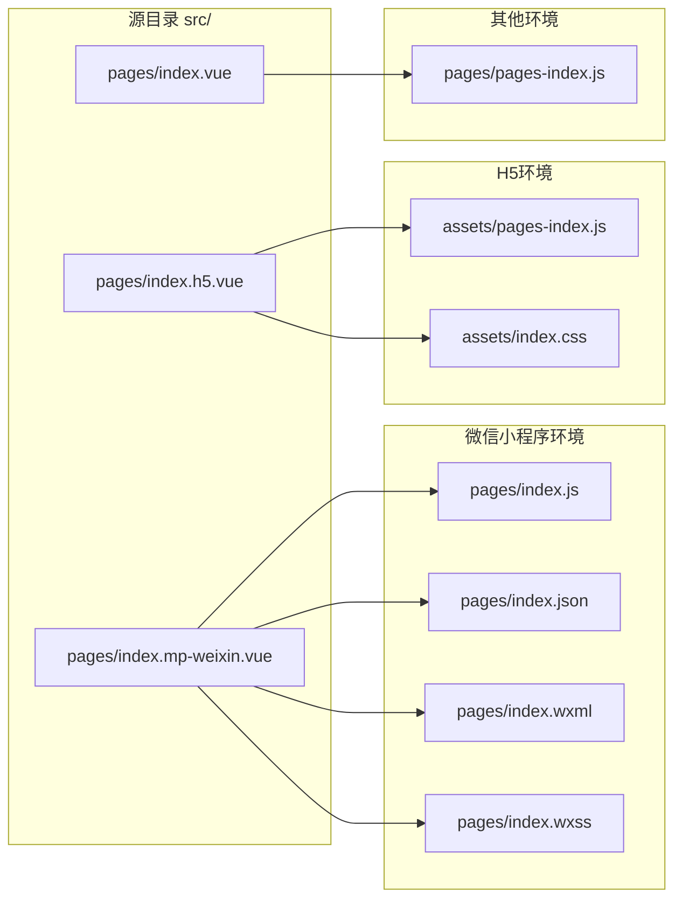

## 安装

:pm-install{name="-D @uni-helper/vite-plugin-uni-platform"}

## 使用

```ts [vite.config.ts]
import Uni from '@dcloudio/vite-plugin-uni'
import UniPlatform from '@uni-helper/vite-plugin-uni-platform'
import { defineConfig } from 'vite'

export default defineConfig({
  plugins: [UniPlatform(), Uni()],
})
```

现在所有的带有平台标识符的文件都会被自动替换！


